<div align="center">



# Gambler's Ruin Simulation

> **🚧 Work in Progress** — Stochastic simulations to study the Gambler's Ruin problem and random walk behavior.

[](https://python.org)
[](.)
[](LICENSE)

</div>

---

## 📖 Overview

The **Gambler's Ruin** is a classic problem in probability theory: a gambler starts with some initial capital and repeatedly bets, winning or losing $1 each round with a fixed probability. The game ends when the gambler either reaches a target fortune or goes **broke (ruin)**.

This project uses **stochastic simulations** in Python to:
- Compute empirical ruin probabilities across different starting capitals
- Analyze how the win probability `p` shifts expected outcomes dramatically
- Visualize random walk trajectories and absorption at boundaries
- Validate simulation results against closed-form analytical solutions

---

## 🎲 The Math Behind It

For a gambler starting with $k$ aiming for $N$, with win probability $p$ per round:

$$P(\text{ruin} \mid k) = \begin{cases} \dfrac{(q/p)^k - (q/p)^N}{1 - (q/p)^N} & p \neq \frac{1}{2} \\[10pt] 1 - \dfrac{k}{N} & p = \frac{1}{2} \end{cases}$$

where $q = 1 - p$.

---

## 🗂️ Project Structure

```
Gambler-s-Ruin-Simulation/
│
├── simulation/
│   ├── gambler_ruin.py       # Core simulation logic
│   ├── random_walk.py        # Random walk generator
│   └── analytics.py          # Statistical analysis & expected values
│
├── plots/
│   ├── ruin_probability.png  # Ruin prob vs initial capital
│   ├── walk_trajectories.png # Sample random walk paths
│   └── heatmap.png           # p vs k heatmap
│
├── notebooks/
│   └── exploration.ipynb     # Jupyter analysis notebook
│
├── tests/
│   └── test_simulation.py    # Validation against analytical results
│
├── banner.svg
├── footer.svg
├── requirements.txt
└── README.md
```

> **Note:** Structure is tentative and will evolve as the project develops.

---

## ⚙️ Installation

```bash
# Clone the repository
git clone https://github.com/Mayankasnora/Gambler-s-Ruin-Simulation.git
cd Gambler-s-Ruin-Simulation

# Install dependencies
pip install -r requirements.txt
```

**Requirements** *(planned)*:
- `numpy` — array ops & random number generation
- `matplotlib` / `seaborn` — plotting
- `scipy` — statistical distributions & validation
- `tqdm` — progress bars for long simulations

---

## 🚀 Usage

```python
# Coming soon — example usage will be added as simulation modules are built
from simulation.gambler_ruin import simulate_ruin

result = simulate_ruin(
    initial_capital=50,
    target=100,
    win_prob=0.48,
    num_trials=10_000
)

print(f"Empirical ruin probability: {result.ruin_prob:.4f}")
print(f"Expected game duration:     {result.avg_duration:.1f} rounds")
```

---

## 📊 Planned Experiments

- [ ] **Baseline**: Fair coin (`p = 0.5`) ruin probability vs. $k$
- [ ] **House edge**: Effect of `p < 0.5` (casino-style odds)
- [ ] **Capital sweep**: How doubling starting capital changes survival
- [ ] **Duration analysis**: Expected number of rounds before absorption
- [ ] **Martingale comparison**: Compare flat-betting vs. doubling strategy
- [ ] **Multi-player extension**: Ruin when competing against another gambler

---

## 📈 Key Findings

> Results will be populated as experiments are completed.

---

## 🤝 Contributing

This is a personal learning project, but suggestions and discussions are welcome. Feel free to open an issue if you spot something interesting or have ideas for extensions.

---

<div align="center">



*🎲 Every random walk ends — the question is where.*

</div>
